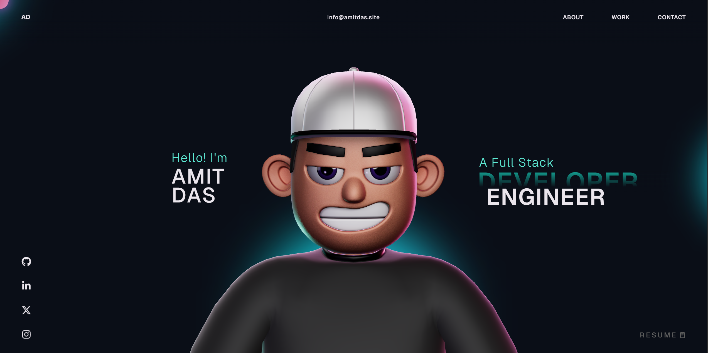

<p align="center">
  
</p>

<p align="center">
  <b>Modern interactive developer Portfolio built with React, GSAP and ThreeJS.</b>
</p>

<h1 align="center">Developer Portfolio — Interactive Web Experience</h1>

<p align="center">
  <b>Creative Web Portfolio ⚡</b><br>
  Developed by <a href="https://www.amitdas.site/">Amit Das</a>
</p>

---

## 🚀 Overview

This repository contains the **open-source version of my personal Portfolio website**.

The website is designed to showcase my **projects, skills, and experience** through a **smooth interactive UI** powered by modern web technologies.

The Portfolio features **advanced animations, smooth scrolling effects, and interactive 3D elements** to create an engaging user experience.

---

## ⚡ Tech Stack

This project is built using modern web technologies:

- React
- TypeScript
- GSAP
- ThreeJS
- WebGL
- HTML
- CSS
- JavaScript

These technologies help deliver **high-performance animations and interactive visuals**.

---

## 🎨 Features

- Smooth scroll animations using **GSAP**
- Interactive **ThreeJS 3D graphics**
- Responsive modern UI
- High-performance WebGL rendering
- Animated sections and transitions
- Interactive project showcase
- Custom cursor and UI effects
- Optimized for modern browsers

---

## 🧠 GSAP Plugin Notice

This project uses **GSAP Club plugins**.

For development purposes, **trial versions of GSAP plugins are included**.

⚠️ Trial plugins **cannot be used for hosting or production deployment**.

To use this project properly, install official GSAP plugins from:

👉 https://gsap.com/docs/v3/Installation/

---

## 📦 Installation

Clone the repository:

```bash
git clone https://github.com/AmitDas4321/Portfolio.git
````

Enter the project folder:

```bash
cd Portfolio
```

Install dependencies:

```bash
npm install
```

Run the development server:

```bash
npm run dev
```

---

## 📁 Project Structure

```
Portfolio
 ├ public/
 │   └ images/
 │       └ preview.png
 ├ src/
 │   ├ components/
 │   ├ styles/
 │   └ utils/
 ├ package.json
 ├ README.md
 └ LICENSE
```

---

## 🌐 Live Preview

You can view the live Portfolio here:

👉 [https://www.amitdas.site](https://www.amitdas.site)

---

## 🧩 Use Cases

### Personal Portfolio

Showcase your projects, skills and experience.

### Developer Branding

Create a strong **online presence** as a developer.

### Animation Showcase

Demonstrates advanced **GSAP + WebGL animation techniques**.

### Learning Resource

Great reference project for learning:

* React animation
* GSAP scroll effects
* ThreeJS integration
* WebGL graphics

---

## 📬 Support

<p align="center">
  <a href="https://t.me/AmitDas4321">
    
  </a>
</p>

---

## 📜 License

MIT License © 2026 Amit Das

---

<p align="center">
  <b>Built with ⚡ using React & GSAP</b><br>
  Made with ❤️ by <a href="https://amitdas.site">Amit Das</a>
</p>